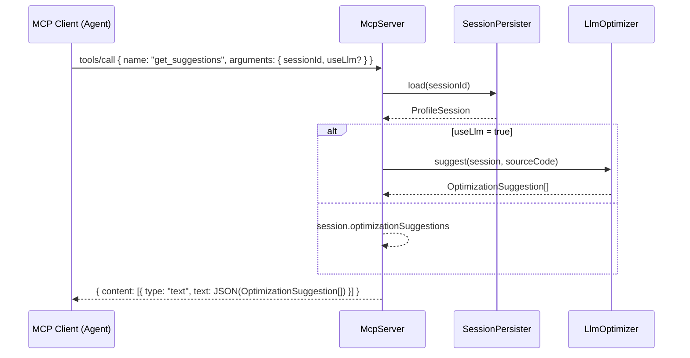
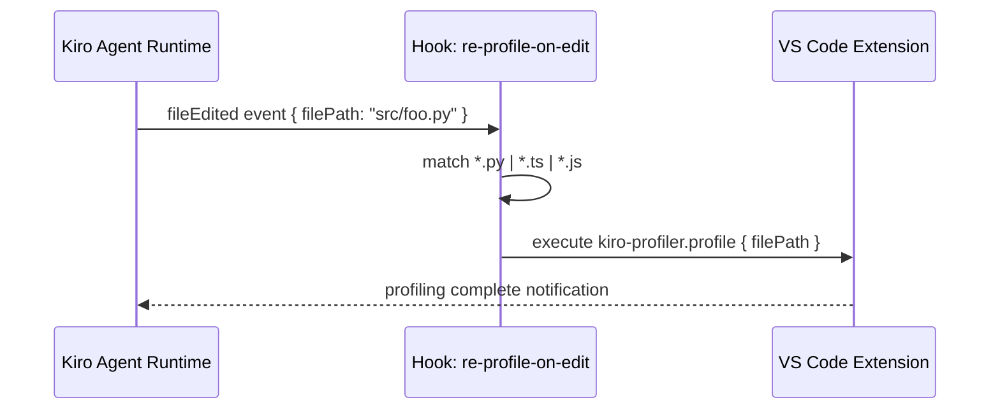

# Design Document: Profiler MCP Server, Powers Packaging, and Agent Hooks

## Overview

This feature extends the `kiro-code-profiler` VS Code extension with three integrated capabilities: an MCP (Model Context Protocol) server that exposes profiler session data and optimization tools to AI agents; a Kiro Power that bundles the MCP server and steering docs into an installable, shareable package; and Agent Hooks that automate profiler workflows in response to file edits, task completions, and manual triggers.

The MCP server runs as a child process alongside the extension, communicating over stdio using the MCP JSON-RPC protocol. The Power manifest references the MCP server entry point and the three existing steering docs. Agent Hooks are declared in `.kiro/hooks/` and invoke VS Code commands or shell scripts that the extension already exposes.

## Architecture

```mermaid
graph TD
    subgraph VS Code Extension Host
        EXT[extension.ts<br/>activate()]
        MCP[McpServer<br/>src/mcp/server.ts]
        SP[SessionPersister]
        ER[ExecutionRunner]
        LLM[LlmOptimizer]
        OPT[Optimizer]
    end

    subgraph Kiro Power
        PWR[.kiro/powers/profiler/power.json]
        S1[steering/architecture.md]
        S2[steering/llm-optimization.md]
        S3[steering/bugfix-workflow.md]
    end

    subgraph Agent Hooks
        H1[hooks/re-profile-on-edit.kiro.yaml<br/>fileEdited]
        H2[hooks/post-task-test.kiro.yaml<br/>postTaskExecution]
        H3[hooks/profile-this-file.kiro.yaml<br/>userTriggered]
    end

    subgraph MCP Clients
        AGENT[Kiro Agent / External MCP Client]
    end

    EXT -->|spawns| MCP
    MCP -->|reads| SP
    MCP -->|invokes| ER
    MCP -->|invokes| LLM
    MCP -->|invokes| OPT
    PWR -->|references| MCP
    PWR -->|includes| S1
    PWR -->|includes| S2
    PWR -->|includes| S3
    AGENT -->|JSON-RPC stdio| MCP
    H1 -->|kiro-profiler.profile command| EXT
    H2 -->|npm test shell script| EXT
    H3 -->|kiro-profiler.profile command| EXT
```

## Sequence Diagrams

### MCP Tool Call: `run_profile`

```mermaid
sequenceDiagram
    participant C as MCP Client (Agent)
    participant S as McpServer
    participant ER as ExecutionRunner
    participant MC as MetricsCollector
    participant EE as EnergyEstimator
    participant SP as SessionPersister
    participant OPT as Optimizer

    C->>S: tools/call { name: "run_profile", arguments: { filePath, language } }
    S->>ER: run(runRequest)
    ER-->>S: ExecutionResult
    S->>MC: aggregate(samples)
    MC-->>S: MetricsSummary
    S->>EE: estimate(avgCpu, execTimeMs)
    EE-->>S: energyMwh
    S->>SP: save(session)
    SP-->>S: void
    S->>OPT: suggest(session)
    OPT-->>S: OptimizationSuggestion[]
    S-->>C: { content: [{ type: "text", text: JSON(ProfileSession) }] }
```

### MCP Tool Call: `get_suggestions`



### Agent Hook: `fileEdited` → re-profile



## Components and Interfaces

### McpServer

**Purpose**: Implements the MCP JSON-RPC server over stdio, exposing profiler capabilities as MCP tools.

**Interface**:
```typescript
class McpServer {
  constructor(
    persister: SessionPersister,
    runner: ExecutionRunner,
    optimizer: Optimizer,
    llmOptimizer: LlmOptimizer,
    workspacePath: string
  )

  start(): void   // begins reading JSON-RPC from stdin, writing to stdout
  stop(): void    // closes streams, cleans up
}
```

**Responsibilities**:
- Parse incoming MCP `initialize`, `tools/list`, and `tools/call` JSON-RPC messages from stdin
- Dispatch tool calls to the appropriate profiler component
- Serialize responses as MCP-compliant JSON-RPC to stdout
- Never write non-JSON-RPC output to stdout (use stderr for logs)

### MCP Tools

| Tool name | Arguments | Returns |
|---|---|---|
| `list_sessions` | `{ workspacePath?: string }` | `SessionSummary[]` |
| `get_session` | `{ sessionId: string }` | `ProfileSession` |
| `run_profile` | `{ filePath: string, language: 'javascript'\|'typescript'\|'python', selectedCode?: string }` | `ProfileSession` |
| `get_suggestions` | `{ sessionId: string, useLlm?: boolean }` | `OptimizationSuggestion[]` |

### Power Manifest

**Purpose**: Declares the Kiro Power bundle — the MCP server entry point plus steering docs.

**File**: `.kiro/powers/profiler/power.json`

```typescript
interface PowerManifest {
  name: string           // "kiro-code-profiler"
  version: string        // semver
  description: string
  mcp: {
    command: string      // "node"
    args: string[]       // ["./out/mcp/server.js"]
    env?: Record<string, string>
  }
  steering: string[]     // relative paths to .md steering docs
}
```

### Agent Hooks

**Purpose**: Automate profiler workflows triggered by IDE events.

**Hook files** live in `.kiro/hooks/` as YAML:

```typescript
interface HookDefinition {
  name: string
  trigger: 'fileEdited' | 'postTaskExecution' | 'userTriggered'
  filePattern?: string    // glob, only for fileEdited
  description: string
  steps: HookStep[]
}

interface HookStep {
  type: 'vscode-command' | 'shell'
  command: string
  args?: Record<string, unknown>
}
```

## Data Models

### McpRequest / McpResponse

```typescript
interface McpRequest {
  jsonrpc: '2.0'
  id: number | string
  method: string
  params?: Record<string, unknown>
}

interface McpResponse {
  jsonrpc: '2.0'
  id: number | string
  result?: unknown
  error?: { code: number; message: string }
}

// tools/call result content block
interface McpToolResult {
  content: Array<{ type: 'text'; text: string }>
  isError?: boolean
}
```

**Validation rules**:
- `jsonrpc` must be exactly `"2.0"`
- `id` must be present on all requests and echoed in responses
- `method` must be one of: `initialize`, `tools/list`, `tools/call`
- Unknown methods return error code `-32601` (Method not found)
- Malformed JSON returns error code `-32700` (Parse error)

### Power Manifest (concrete)

```typescript
// .kiro/powers/profiler/power.json
{
  "name": "kiro-code-profiler",
  "version": "0.0.1",
  "description": "Profiler MCP server + steering docs for kiro-code-profiler",
  "mcp": {
    "command": "node",
    "args": ["./out/mcp/server.js"],
    "env": {}
  },
  "steering": [
    "../../steering/architecture.md",
    "../../steering/llm-optimization.md",
    "../../steering/bugfix-workflow.md"
  ]
}
```

### Hook Definitions (concrete)

```yaml
# .kiro/hooks/re-profile-on-edit.kiro.yaml
name: re-profile-on-edit
trigger: fileEdited
filePattern: "**/*.{py,ts,js}"
description: >
  Remind the agent to re-profile after significant edits to profiled source files.
steps:
  - type: vscode-command
    command: kiro-profiler.profile
    args:
      filePath: "{{event.filePath}}"
```

```yaml
# .kiro/hooks/post-task-test.kiro.yaml
name: post-task-test
trigger: postTaskExecution
description: >
  Run the full test suite after each spec task completes to catch regressions.
steps:
  - type: shell
    command: "cd kiro-code-profiler && npm test"
```

```yaml
# .kiro/hooks/profile-this-file.kiro.yaml
name: profile-this-file
trigger: userTriggered
description: >
  Manually trigger a profile run on the currently active file.
steps:
  - type: vscode-command
    command: kiro-profiler.profile
    args:
      filePath: "{{activeFile}}"
```

## Key Functions with Formal Specifications

### `McpServer.handleToolCall(request)`

```typescript
async handleToolCall(request: McpRequest): Promise<McpResponse>
```

**Preconditions:**
- `request.method === 'tools/call'`
- `request.params.name` is one of the four registered tool names
- `request.params.arguments` is a valid object (may be empty)

**Postconditions:**
- Returns a `McpResponse` with the same `id` as the request
- On success: `result.content[0].type === 'text'` and `result.content[0].text` is valid JSON
- On unknown tool: `error.code === -32601`
- On tool execution failure: `result.isError === true` and `result.content[0].text` contains the error message
- Never throws — all errors are returned as MCP error responses

**Loop Invariants:** N/A

### `McpServer.readLoop()`

```typescript
private async readLoop(): Promise<void>
```

**Preconditions:**
- `stdin` is open and readable
- Server has been initialized via `initialize` handshake

**Postconditions:**
- Each complete newline-delimited JSON message on stdin is parsed and dispatched
- Partial messages are buffered until a newline is received
- On parse error: writes a `-32700` error response to stdout and continues reading
- Loop exits cleanly when stdin closes

**Loop Invariants:**
- `buffer` contains only the unprocessed tail of the most recent stdin chunk
- Every complete message in `buffer` has been dispatched before the next chunk is appended

### `runProfileTool(args)`

```typescript
async function runProfileTool(
  args: { filePath: string; language: string; selectedCode?: string },
  runner: ExecutionRunner,
  persister: SessionPersister,
  optimizer: Optimizer,
  workspacePath: string
): Promise<ProfileSession>
```

**Preconditions:**
- `args.filePath` is an absolute path to an existing file
- `args.language` is one of `'javascript' | 'typescript' | 'python'`
- `runner`, `persister`, `optimizer` are fully initialized

**Postconditions:**
- Returns a `ProfileSession` with a valid uuid v4 `id`
- Session is persisted to disk via `persister.save()`
- `session.optimizationSuggestions` contains rule-based suggestions from `optimizer`
- If execution fails (non-zero exit): session is still saved with the error exit code

**Loop Invariants:** N/A

## Algorithmic Pseudocode

### MCP Read Loop

```pascal
ALGORITHM readLoop()
INPUT: stdin stream
OUTPUT: dispatched responses on stdout

BEGIN
  buffer ← ""
  
  WHILE stdin IS open DO
    chunk ← await stdin.read()
    buffer ← buffer + chunk
    
    WHILE buffer CONTAINS "\n" DO
      ASSERT buffer is non-empty
      
      line ← buffer.substring(0, indexOf("\n"))
      buffer ← buffer.substring(indexOf("\n") + 1)
      
      IF line IS empty THEN
        CONTINUE
      END IF
      
      TRY
        request ← JSON.parse(line)
        response ← await dispatch(request)
      CATCH parseError
        response ← errorResponse(-32700, "Parse error", null)
      END TRY
      
      stdout.write(JSON.stringify(response) + "\n")
    END WHILE
  END WHILE
END
```

**Loop Invariants:**
- `buffer` never contains a fully-formed newline-terminated message after the inner loop exits
- Every parsed request produces exactly one response written to stdout

### Tool Dispatch

```pascal
ALGORITHM dispatch(request)
INPUT: request of type McpRequest
OUTPUT: response of type McpResponse

BEGIN
  IF request.method = "initialize" THEN
    RETURN initializeResponse(request.id)
  END IF
  
  IF request.method = "tools/list" THEN
    RETURN toolsListResponse(request.id, REGISTERED_TOOLS)
  END IF
  
  IF request.method = "tools/call" THEN
    toolName ← request.params.name
    args     ← request.params.arguments
    
    CASE toolName OF
      "list_sessions"  → result ← await listSessionsTool(args)
      "get_session"    → result ← await getSessionTool(args)
      "run_profile"    → result ← await runProfileTool(args)
      "get_suggestions"→ result ← await getSuggestionsTool(args)
      OTHERWISE        → RETURN errorResponse(-32601, "Method not found", request.id)
    END CASE
    
    RETURN successResponse(request.id, result)
  END IF
  
  RETURN errorResponse(-32601, "Method not found", request.id)
END
```

## Example Usage

```typescript
// Extension activate() — spawn MCP server as a child process
import { McpServer } from './mcp/server';

export async function activate(context: vscode.ExtensionContext) {
  const workspacePath = vscode.workspace.workspaceFolders?.[0].uri.fsPath ?? '';
  const persister = new SessionPersister(workspacePath);
  const runner = new ExecutionRunner();
  const optimizer = new Optimizer(thresholds);
  const llmOptimizer = new LlmOptimizer(context.secrets);

  const mcpServer = new McpServer(persister, runner, optimizer, llmOptimizer, workspacePath);
  mcpServer.start();
  context.subscriptions.push({ dispose: () => mcpServer.stop() });

  // ... existing command registrations
}
```

```typescript
// MCP client interaction (agent side) — list_sessions
const request: McpRequest = {
  jsonrpc: '2.0',
  id: 1,
  method: 'tools/call',
  params: {
    name: 'list_sessions',
    arguments: { workspacePath: '/path/to/workspace' }
  }
};
// Response: { jsonrpc: '2.0', id: 1, result: { content: [{ type: 'text', text: '[...]' }] } }
```

```typescript
// MCP client interaction — run_profile then get_suggestions with LLM
const profileReq: McpRequest = {
  jsonrpc: '2.0', id: 2, method: 'tools/call',
  params: { name: 'run_profile', arguments: { filePath: '/ws/demo.py', language: 'python' } }
};
// ... send, receive ProfileSession in response

const suggestReq: McpRequest = {
  jsonrpc: '2.0', id: 3, method: 'tools/call',
  params: { name: 'get_suggestions', arguments: { sessionId: '<uuid>', useLlm: true } }
};
// ... receive OptimizationSuggestion[]
```

## Correctness Properties

- For all valid `tools/call` requests, the response `id` equals the request `id`
- For all `run_profile` calls with a valid `filePath`, the returned session is retrievable via `get_session` with the same `sessionId`
- For all `list_sessions` calls, every returned `SessionSummary.id` is loadable via `get_session`
- For all malformed JSON inputs, the server writes a `-32700` error response and continues processing subsequent messages (no crash)
- For all unknown tool names, the server returns a `-32601` error and does not modify persisted state
- `run_profile` with a non-zero exit code still persists the session (partial metrics are preserved)
- The `post-task-test` hook fires exactly once per completed spec task, regardless of task outcome

## Error Handling

### MCP Parse Error

**Condition**: stdin delivers a line that is not valid JSON
**Response**: Write `{ jsonrpc: "2.0", id: null, error: { code: -32700, message: "Parse error" } }` to stdout
**Recovery**: Continue reading the next line; do not terminate the server

### Tool Execution Failure

**Condition**: A tool handler throws (e.g. `SessionPersister.load` throws because the file doesn't exist)
**Response**: Return `{ result: { content: [{ type: "text", text: "<error message>" }], isError: true } }`
**Recovery**: Server remains running; subsequent tool calls are unaffected

### `run_profile` — File Not Found

**Condition**: `args.filePath` does not exist on disk
**Response**: `ExecutionRunner` returns a non-zero `exitCode`; session is saved with the error; `isError: true` in MCP response
**Recovery**: Agent receives the error content and can retry with a corrected path

### Hook — Command Not Found

**Condition**: A hook's `vscode-command` references a command not registered in the extension
**Response**: Kiro agent runtime logs the error and skips the hook step
**Recovery**: Remaining hook steps execute normally

## Testing Strategy

### Unit Testing Approach

Each MCP tool handler is tested in isolation by constructing a `McpServer` with mock implementations of `SessionPersister`, `ExecutionRunner`, `Optimizer`, and `LlmOptimizer`. Tests cover:
- Happy path for each of the four tools
- Error paths: missing session ID, invalid language, file not found
- JSON-RPC protocol compliance: correct `id` echoing, correct error codes

### Property-Based Testing Approach

**Property Test Library**: fast-check

Key properties:
- For any `McpRequest` with a valid `id` (number or string), the response always echoes the same `id`
- For any sequence of `run_profile` + `get_session` calls with the same `sessionId`, `get_session` returns the session saved by `run_profile`
- For any arbitrary byte string on stdin, the read loop never crashes (always produces a valid JSON-RPC response or continues)

### Integration Testing Approach

End-to-end test spawns `out/mcp/server.js` as a child process, writes JSON-RPC messages to its stdin, and asserts on stdout responses. Covers the full `run_profile → get_session → get_suggestions` workflow against the real `demo/demo.py` fixture.

## Performance Considerations

- The MCP server runs in the same Node.js process as the extension (not a separate child process) to avoid IPC overhead; it reads from a virtual stdin/stdout pair when invoked programmatically, or real stdio when launched standalone
- `list_sessions` reads all session JSON files on each call; for workspaces with >100 sessions, consider adding an in-memory index in `SessionPersister`
- `run_profile` is inherently blocking for the duration of the profiled process; the MCP server should not accept concurrent `run_profile` calls — queue them or return an error if one is already in progress

## Security Considerations

- The MCP server inherits the extension's OpenAI API key resolution; `get_suggestions` with `useLlm: true` will consume API quota — agents should be aware of this
- The `run_profile` tool executes arbitrary files on disk; the server should validate that `filePath` is within the workspace root before executing
- Hook YAML files are loaded from `.kiro/hooks/` which is workspace-controlled; malicious hook definitions could execute arbitrary shell commands — treat hook files with the same trust level as workspace configuration

## Dependencies

- No new npm dependencies required for the MCP server — uses Node.js built-in `readline` for stdin parsing and existing `uuid`, `SessionPersister`, `ExecutionRunner`, `Optimizer`, `LlmOptimizer` from the extension
- Power manifest format: JSON file, no additional tooling required
- Hook YAML format: parsed by the Kiro agent runtime, not by the extension itself
- MCP protocol version: `2024-11-05` (current stable)
