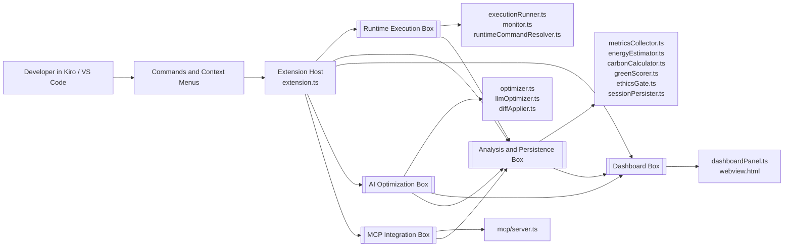

# Kiro Spark Challenge — Kiro Code Profiler

A Kiro/VS Code extension that profiles your code's resource usage and generates AI-powered optimization suggestions. Built at the ASU Hackathon, April 24 2026.

---

## What It Does

- Profiles Node.js and Python scripts to capture CPU, RAM, disk I/O, energy consumption, and execution time.
- Runs continuous monitoring with configurable alerts when resource thresholds are exceeded.
- Generates AI-powered optimization suggestions using GPT-4o-mini — accept or reject each one directly from the dashboard.
- Estimates carbon impact per run and projects annual CO₂e emissions.
- Compares sessions against a baseline to track performance improvements over time.

---

## Project Structure

```
├── kiro-code-profiler/       # The VS Code / Kiro extension
│   ├── src/
│   │   ├── extension.ts          # Extension entry point, command registration
│   │   ├── executionRunner.ts    # Spawns target process, captures output
│   │   ├── metricsCollector.ts   # Polls CPU, RAM, disk, network at intervals
│   │   ├── energyEstimator.ts    # CPU-weighted TDP energy estimation
│   │   ├── sessionPersister.ts   # Reads/writes session JSON to disk
│   │   ├── optimizer.ts          # Rule-based optimization suggestions
│   │   ├── llmOptimizer.ts       # GPT-4o-mini prompt construction and parsing
│   │   ├── diffApplier.ts        # Unified diff parser and applier
│   │   ├── baselineComparison.ts # Session-to-baseline delta computation
│   │   ├── configurationManager.ts
│   │   ├── monitor.ts            # Live monitoring mode
│   │   ├── dashboard/            # Webview dashboard (HTML + JS)
│   │   ├── types.ts              # Shared TypeScript interfaces
│   │   └── tests/                # Unit and property-based tests (vitest)
│   ├── package.json
│   └── README.md                 # Detailed extension docs
├── demo/
│   ├── slow_demo.py              # Intentionally inefficient code for testing
│   └── demo.py                   # Optimized version after AI suggestions
└── README.md                     # This file
```

---

## Architecture



### Architecture Notes

- `Extension Host`: activates commands, coordinates profiling, monitoring, re-profiling, and dashboard updates.
- `Runtime Execution Box`: chooses the runtime and launches JS, TS, or Python targets.
- `Analysis and Persistence Box`: collects metrics, estimates energy/carbon impact, applies the ethics gate, and stores sessions.
- `Dashboard Box`: renders history, charts, baseline comparisons, alerts, and suggestion workflows.
- `AI Optimization Box`: produces rule-based and LLM-based suggestions and applies diffs.
- `MCP Integration Box`: exposes sessions and optimization tooling to external MCP clients.

---

## Quick Start

1. Install dependencies:
   ```
   cd kiro-code-profiler
   npm install
   ```

2. Build the extension:
   ```
   node esbuild.js
   ```

3. Package the VSIX:
   ```
   npx @vscode/vsce package
   ```

4. Install in Kiro: Command Palette → "Extensions: Install from VSIX…" → select the generated `.vsix`.

5. Set your OpenAI API key (for AI optimization): Settings → Kiro Code Profiler → OpenAI API Key, or set the `OPENAI_API_KEY` environment variable.

6. Open a `.py` or `.js`/`.ts` file, run **Kiro Profiler: Profile**, then **Kiro Profiler: Optimize with AI**.

---

## Demo Files

`demo/slow_demo.py` contains intentionally inefficient patterns (naive prime finding, exponential Fibonacci, bubble sort, string concatenation in loops, linear search instead of set lookup). Profile it, run AI optimization, and accept the suggestions to see the improvements. `demo/demo.py` is the optimized result.

---

## License

This project is licensed under the MIT License - see the [LICENSE](./LICENSE) file for details.
