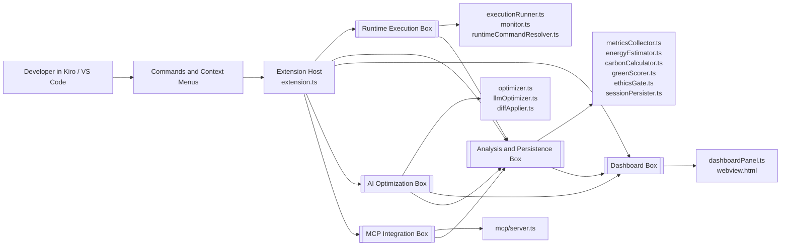

# EcoTrace — Kiro Code Profiler

> **Every function has a carbon footprint. Now you can see it.**

EcoTrace profiles your code's energy consumption, translates it into real-world CO₂ impact, grades it with a Green Code Score, and uses AI to help you write greener software — all without leaving Kiro.

Built for the **Kiro Spark Challenge** (ASU × Toptal × Kiro, April 2026).
Challenge frame: **Environment — The Accountability Guardrail**.

---

## The Problem

Data centers consume 1–1.5% of global electricity, emitting ~200 million tons of CO₂ annually. But individual developers have never seen the environmental cost of their code. A poorly optimized loop doesn't just waste CPU cycles — it wastes electricity and emits carbon.

**EcoTrace makes that hidden cost visible, measurable, and actionable.**

---

## How It Works

```
Run your code  →  Measure energy (CPU × TDP × time)
                              ↓
             Carbon Impact (EPA eGRID 386g CO₂/kWh)
                              ↓
          Green Code Score  (A++ → F  ·  0–100)
                              ↓
         AI Optimization Suggestions  (GPT-4o-mini)
                              ↓
         Apply fixes → Re-profile → See CO₂ saved
```

### Carbon Accountability

When you profile a file, EcoTrace shows:

| Signal | What it tells you |
|---|---|
| **Green Score** | Letter grade A++ → F based on energy per run |
| **CO₂ per run** | Exact emissions in ng/μg/mg/g using EPA eGRID data |
| **Annual projection** | CO₂ at 100 runs/day for 365 days |
| **Equivalents** | 🚗 driving distance · 🎬 Netflix minutes · 💡 electricity cost |
| **Trees to offset** | How many trees would absorb this annual CO₂ |

### Ethics Logic Gate

Set `kiro-profiler.carbonBudgetGramsPerYear` (e.g. `50`) to enable the **Ethics Gate**. After every profile run, EcoTrace checks whether the projected annual CO₂ exceeds your budget:

- **Exceeded** → Red banner in the dashboard + VS Code warning notification. The gate stops you from shipping code that violates your environmental commitment.
- **Within budget** → Green confirmation banner.

This is the challenge's "Ethics Logic Gate" requirement: a literal piece of code (`CarbonEthicsGate`) that stops the process when a rule is violated.

### AI Optimization

Right-click any JS/TS/Python file → **Optimize with LLM** to get GPT-4o-mini suggestions as unified diffs. Accept individual suggestions or **Accept All** — EcoTrace re-profiles automatically and shows you the before/after CO₂ reduction.

---

## Installation

1. Open Kiro.
2. Open the Command Palette (`Ctrl+Shift+P` / `Cmd+Shift+P`).
3. Run **Extensions: Install from VSIX...** and select the `.vsix` file.
4. Reload Kiro.

---

## Commands

| Command | Description |
|---|---|
| **Kiro Profiler: Profile** | Run the active file and capture CPU, RAM, energy, and carbon impact. |
| **Kiro Profiler: Monitor** | Continuous live monitoring with threshold alerts. |
| **Kiro Profiler: Show Dashboard** | Open the EcoTrace dashboard. |
| **Kiro Profiler: Optimize with LLM** | Get AI-generated optimization diffs for the active file. |
| **Kiro Profiler: Accept All Suggestions** | Apply all AI suggestions and re-profile. |
| **Kiro Profiler: Clear History** | Delete all saved profiling sessions. |

---

## Configuration

| Setting | Default | Description |
|---|---|---|
| `kiro-profiler.carbonBudgetGramsPerYear` | `0` | **Ethics Gate** budget (g CO₂/year at 100 runs/day). `0` = disabled. |
| `kiro-profiler.ramAlertThresholdMb` | `512` | RAM alert threshold (MB). |
| `kiro-profiler.cpuAlertThresholdPercent` | `80` | CPU alert threshold (0–100). |
| `kiro-profiler.sampleIntervalMs` | `1000` | Metric sampling interval (min 100ms). |
| `kiro-profiler.openaiApiKey` | `""` | OpenAI API key for LLM optimization. |
| `kiro-profiler.runtimePaths.node` | `null` | Custom Node.js path. |
| `kiro-profiler.runtimePaths.python` | `null` | Custom Python path. |

---

## Green Code Score Reference

| Grade | Energy/run | What it means |
|---|---|---|
| A++ | < 0.1 mWh | Ultra-efficient — negligible footprint |
| A+  | < 1 mWh   | Excellent — minimal environmental impact |
| A   | < 5 mWh   | Great — well within green boundaries |
| B   | < 20 mWh  | Good — some room for improvement |
| C   | < 100 mWh | Fair — optimization recommended |
| D   | < 500 mWh | Poor — significant energy waste |
| F   | ≥ 500 mWh | Critical — major optimization required |

---

## Architecture



### Module Map

- `extension.ts`: central activation point, command registration, profiling flow, re-profile flow, dashboard sync.
- `runtimeCommandResolver.ts`: fast runtime selection, especially for TypeScript where local binaries are preferred over `npx ts-node`.
- `executionRunner.ts` and `monitor.ts`: process launch paths for batch profiling and live monitoring.
- `metricsCollector.ts`, `energyEstimator.ts`, `greenScorer.ts`, `carbonCalculator.ts`, `ethicsGate.ts`: measurement and sustainability analysis pipeline.
- `optimizer.ts`, `llmOptimizer.ts`, `diffApplier.ts`: suggestion generation and application pipeline.
- `sessionPersister.ts` and `baselineComparison.ts`: session history, baseline tracking, and comparisons.
- `dashboard/dashboardPanel.ts` and `dashboard/webview.html`: rendered dashboard, alerts, charts, baseline view, and suggestion UI.
- `mcp/server.ts`: external tool interface for MCP-based integrations.

**Supported languages:** JavaScript, TypeScript, Python

---

## Kiro Spark Challenge

**Frame:** Environment — The Accountability Guardrail

| Prize Signal | How EcoTrace competes |
|---|---|
| **Build** | Real metrics pipeline (pidusage + si), AI diffs, MCP server, 20+ tests |
| **Impact** | Measurable CO₂ reduction per developer action; annual projection at scale |
| **Story** | Every dev × every function × greener code = compounding planetary impact |
| **Collaboration** | Spec-driven development via Kiro (see `.kiro/specs/`) |

---

## License

MIT
